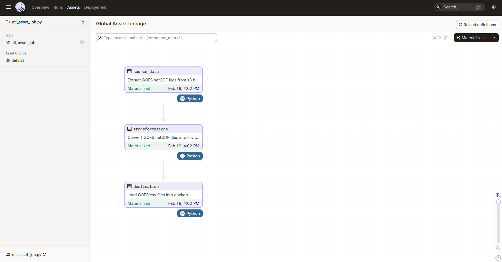

# Modern Data Orchestration Platform

An example using [Dagster Software-Defined Assets](https://docs.dagster.io/concepts/assets/software-defined-assets) to orchestrate a batch ETL pipeline. 
Process downloads [NOAA GOES-R GLM](https://www.goes-r.gov/spacesegment/glm.html) files from AWS s3 bucket, converts them into time series csv 
and loads them to a local backend, persistant duckdb. 

## Installation

First make sure, you have the requirements installed, this can be installed from the project directory via pip's requirements.txt:

`pip install -r requirements.txt`

Run the command to start the dagster orchestration framework: 

`dagster dev -f etl_asset_job.py # Start dagster daemon and dagit ui`

The dagster daemon is required to start the scheduling, from the dagit ui, you can run and monitor the data assets.

## License

[Apache 2.0 License](LICENSE)